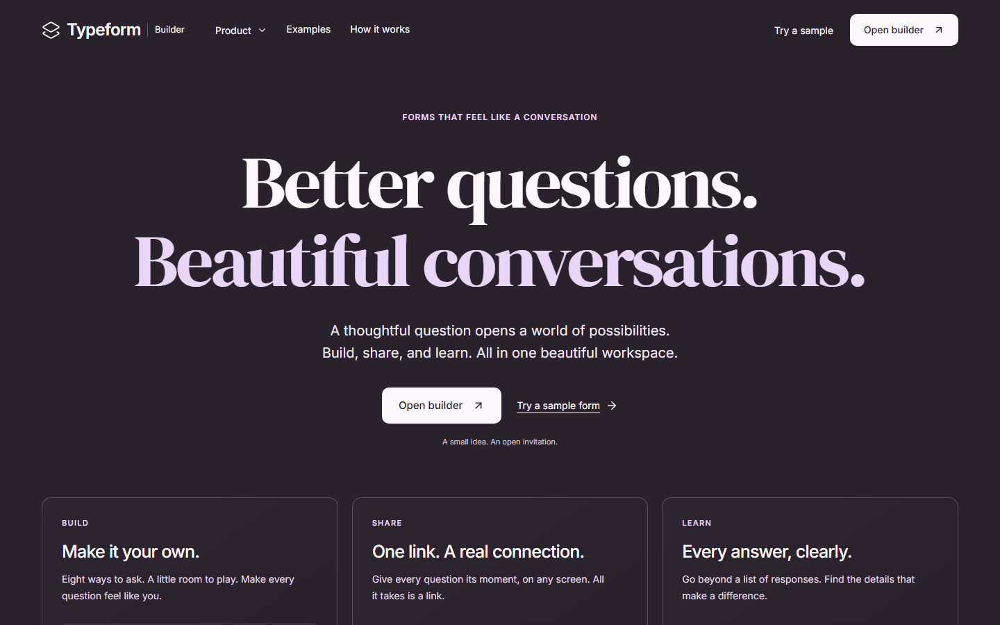
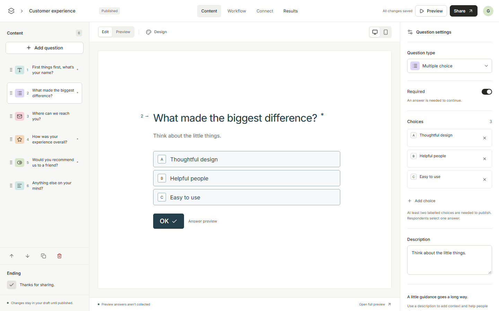
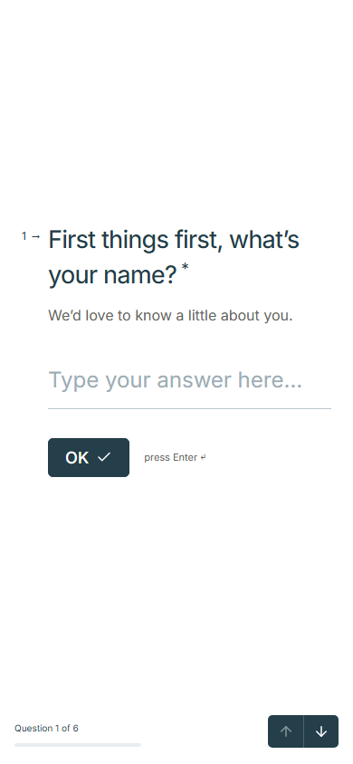
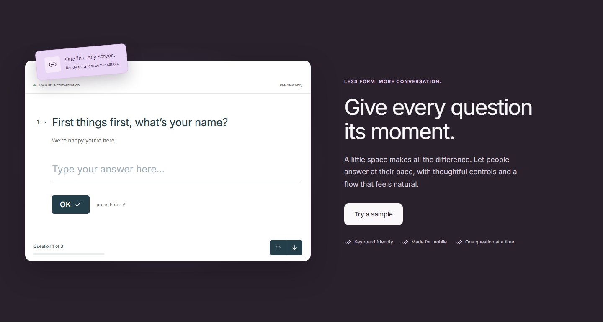
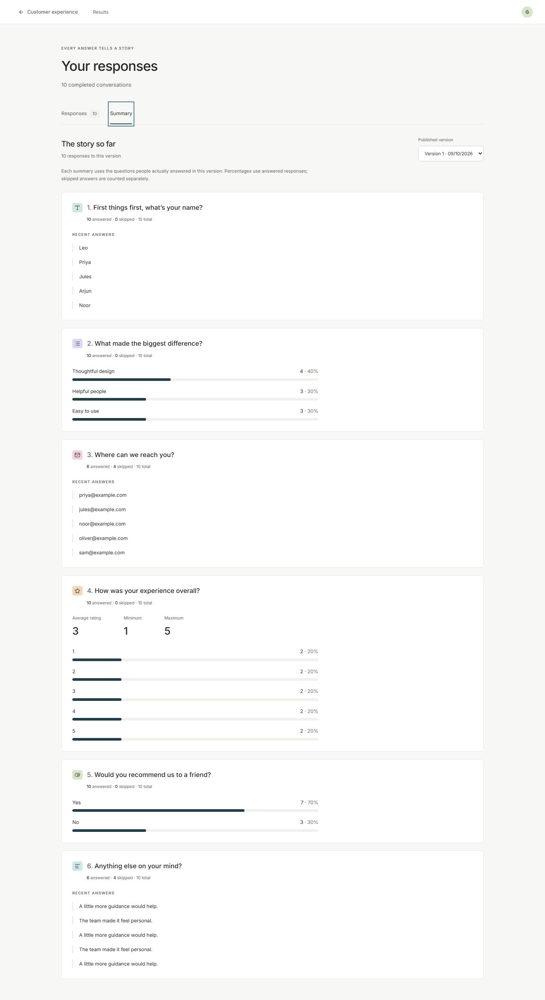
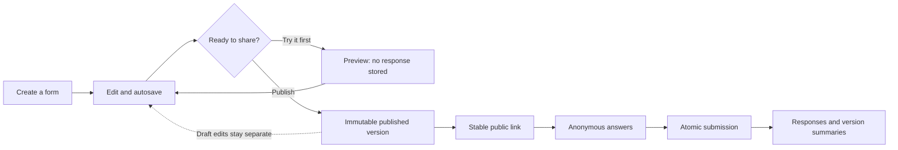
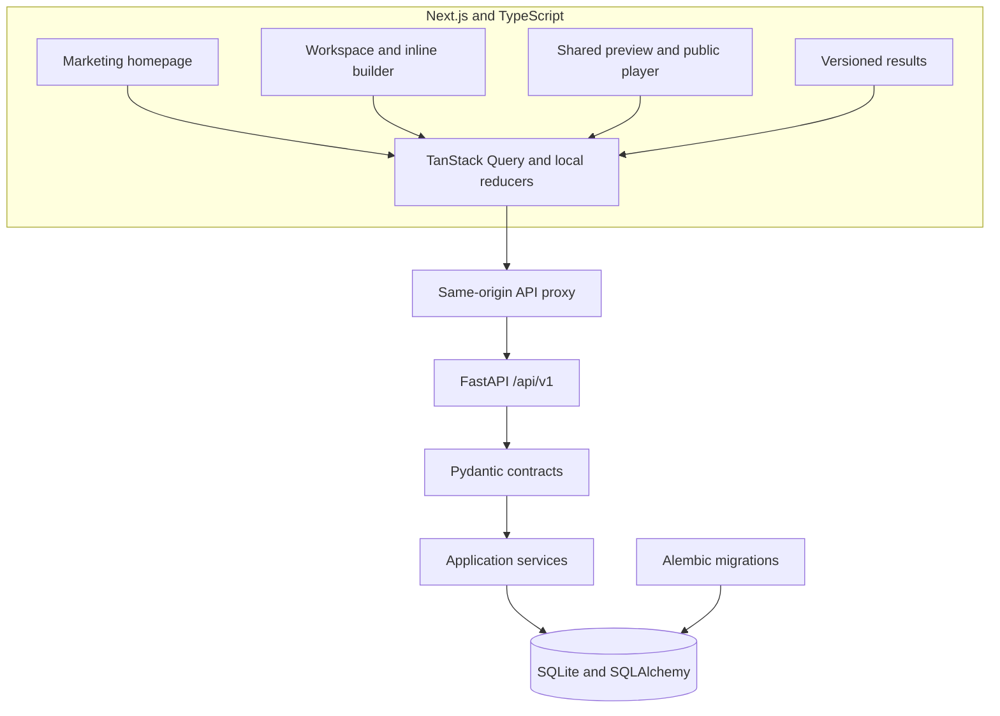

<div align="center">

<h1>Typeform Builder</h1>

<p><strong>Better questions. Beautiful conversations.</strong></p>

<p>An original form builder, conversational player and results workspace.<br />Built with Next.js, FastAPI and durable SQLite storage.</p>

[Explore the interface](#a-look-inside) · [Run locally](#run-locally) · [Architecture](#architecture) · [Deployment](docs/deployment.md)

[](https://nextjs.org/docs)
[](https://react.dev/)
[](https://www.typescriptlang.org/docs/)
[](https://fastapi.tiangolo.com/)
[](https://sqlite.org/)
[](https://tailwindcss.com/)

</div>



> **Build status:** the six-phase core is verified locally. A working hosted demo has not been
> verified. Final assignment submission requires current source in the
> [public repository](https://github.com/Gupta2708/Typeform-clone) and a working hosted demo.

## What you can build

| Experience   | What works                                                                                              |
| ------------ | ------------------------------------------------------------------------------------------------------- |
| **Discover** | Animated homepage, interactive product previews, real example forms, accessible navigation              |
| **Build**    | Inline editing, eight question types, descriptions, required fields, bounds, options and reordering     |
| **Save**     | Serialized autosave, revision guards, retry and explicit conflict resolution without losing local edits |
| **Publish**  | Immutable versions, stable public links, isolated drafts and unpublishing                               |
| **Respond**  | One question at a time, keyboard controls, Back, progress, validation and safe submission retry         |
| **Learn**    | Paginated responses, original historical answers and summaries scoped to each published version         |
| **Manage**   | Search, grid/list views, real counts, rename, duplicate and confirmed deletion                          |

**Eight ways to ask:** Short text · Long text · Multiple choice · Dropdown · Email · Number · Yes/No · Rating.

Preview shares the public player's widgets and stores no responses. Optional unanswered values are
omitted; `false` and `0` remain valid answers. The creator workspace is shared, without account
authentication. Workflow and integrations are clearly marked Coming soon; additional themes and
optional bonuses are deferred.

## A look inside

| Create with focus                                                                                                  | Answer at your own pace                                                                          |
| ------------------------------------------------------------------------------------------------------------------ | ------------------------------------------------------------------------------------------------ |
|  |  |

<details>
<summary><strong>See previews, results and mobile layouts</strong></summary>





[Mobile homepage](docs/screenshots/landing/homepage-390.png) · [Full desktop homepage](docs/screenshots/landing/homepage-1440.png) · [All visual checkpoints](docs/acceptance-checklist.md)

</details>

## From a question to an insight



The server confirms a submission before showing thank-you. Retries reuse the same idempotency key,
and later edits cannot change the labels or values of historical answers.

## Run locally

You need **Node >=20.9**, **Python >=3.11**, [uv](https://docs.astral.sh/uv/) and Git.
Verified with Node 24.14.1, npm 11.11.0 and Python 3.11.6.

Clone the repository, then start the API:

```powershell
git clone https://github.com/Gupta2708/Typeform-clone.git
cd Typeform-clone/backend
Copy-Item .env.example .env
uv sync --locked --cache-dir ../.cache/uv
.\.venv\Scripts\python.exe -m alembic upgrade head
.\.venv\Scripts\python.exe -m scripts.seed --demo
.\.venv\Scripts\python.exe -m uvicorn app.main:app --host 127.0.0.1 --port 8000
```

In another terminal, from the repository root:

```powershell
cd frontend
Copy-Item .env.example .env.local
npm ci --cache ../.cache/npm
npm run dev
```

| Open                       | Address                                                                       |
| -------------------------- | ----------------------------------------------------------------------------- |
| Homepage                   | [localhost:3000](http://localhost:3000)                                       |
| Creator workspace          | [localhost:3000/workspace](http://localhost:3000/workspace)                   |
| Customer experience sample | [localhost:3000/to/demo-experience](http://localhost:3000/to/demo-experience) |
| Community event sample     | [localhost:3000/to/demo-event](http://localhost:3000/to/demo-event)           |
| API schemas                | [localhost:8000/docs](http://localhost:8000/docs)                             |
| Database health            | [localhost:8000/health](http://localhost:8000/health)                         |

Commands above use PowerShell. On Linux/macOS, replace `.venv\Scripts\python.exe` with
`.venv/bin/python`. Do not overwrite existing environment files when repeating setup. Both
typefaces are bundled locally; the application does not need a font service.

### Try the seeded forms

The explicit, idempotent `scripts.seed --demo` command adds **two published forms with ten valid
responses each and one draft** to a fresh database. Reruns preserve existing edits and records.

1. Open **Customer experience**. Edit a question, change its settings and reorder it.
2. Preview it. Finish the conversation and confirm the response count stays the same.
3. Publish your changes. Open the stable link in a private browser and submit an answer.
4. Explore **Results**. Compare individual responses with summaries from the published version.
5. Try **Community event** for dropdown, number, yes/no and long-text questions. **Product discovery** is a draft preview.

Normal startup never seeds data or creates tables. New submissions naturally increase the counts.

## Architecture



| Layer        | Tools and responsibility                                                         |
| ------------ | -------------------------------------------------------------------------------- |
| Interface    | Next.js App Router, React, TypeScript and Tailwind CSS                           |
| Interaction  | Radix dialogs, dnd-kit ordering, Motion transitions and Lucide icons             |
| State        | TanStack Query for server data, serialized draft store, reducer-driven player    |
| API          | FastAPI routes, Pydantic contracts and separate application services             |
| Storage      | SQLAlchemy models, Alembic migrations, relational drafts and immutable snapshots |
| Verification | pytest, Ruff, TypeScript, ESLint, Playwright and axe                             |

Autosave debounces for 650 ms with one request in flight. Draft and metadata writes share
`expected_revision`; stale writes return `409`. A conflict retains local edits, offers a draft
download and blocks publication. Discarding requires explicit confirmation.

SQLite foreign keys enforce version ownership. Transactions keep submissions and answers atomic.
Use one backend instance with a persistent database volume.

```text
frontend/   Routes, UI components, state, contracts and browser checks
backend/    API routes, schemas, services, persistence, migrations and tests
docs/       Architecture, API contracts, screenshots and deployment guides
```

<details>
<summary><strong>Environment variables</strong></summary>

| Variable            | Where            | Purpose                                                                       |
| ------------------- | ---------------- | ----------------------------------------------------------------------------- |
| `DATABASE_URL`      | Backend `.env`   | Default `sqlite:///./data/typeform.db`; relative to backend working directory |
| `CORS_ORIGINS`      | Backend `.env`   | JSON allowlist; `[]` with the same-origin proxy                               |
| `MAX_REQUEST_BYTES` | Backend `.env`   | Default 1048576; bounded write payloads                                       |
| `API_BASE_URL`      | Frontend build   | Server-only API rewrite target; rebuild when it changes                       |
| `PORT`, `HOSTNAME`  | Frontend runtime | Standalone listener; default 3000 / 0.0.0.0                                   |

</details>

## Verify the project

Backend:

```powershell
cd backend
.\.venv\Scripts\python.exe -m pytest --basetemp ../.cache/pytest-local
.\.venv\Scripts\python.exe -m ruff check .
.\.venv\Scripts\python.exe -m ruff format --check .
.\.venv\Scripts\python.exe -m alembic check
```

Frontend:

```powershell
cd frontend
npm run typecheck
npm run lint
npm run build
$env:PLAYWRIGHT_BROWSERS_PATH = (Join-Path (Resolve-Path ..).Path '.cache/browsers')
npx playwright install chromium
npm run test:e2e
```

Playwright starts isolated services on ports 3001/8001 with `.cache/e2e.db` and `.next-e2e`.
It covers autosave races/conflicts, deliberate discard, preview isolation, submission retry,
keyboard controls, historical results, accessibility and responsive layouts. Checkpoint
screenshots are stored in `docs/screenshots/`.

Read the [core verification report](docs/phase-6-report.md) and
[homepage verification report](docs/landing-report.md) for observed checks and remaining limits.

## Deploy with durable storage

For a local production frontend, keep the API running and stop the development frontend:

```powershell
cd frontend
npm run build
$env:HOSTNAME = '127.0.0.1'
$env:PORT = '3000'
npm start
```

The build prepares standalone output with static assets and bundled fonts. The
[deployment guide](docs/deployment.md) covers Compose/Caddy, environment setup, persistent
SQLite volumes, backups/restores and hosted smoke checks.

Compose configuration has been validated. Container execution and a working hosted demo are
unverified. Local URLs do not satisfy the assignment's hosted-demo requirement.

## Project guides

| Guide                                                  | What you will find                                              |
| ------------------------------------------------------ | --------------------------------------------------------------- |
| [Architecture](docs/architecture.md)                   | Module boundaries, database schema and data invariants          |
| [API contracts](docs/api-contracts.md)                 | Versioned endpoints, payloads, errors and summaries             |
| [Visual references](docs/ui-reference.md)              | Official references and observed design choices                 |
| [Homepage references](docs/landing-report.md)          | Additional official image references, design choices and checks |
| [Acceptance checkpoints](docs/acceptance-checklist.md) | Six phases and browser evidence                                 |
| [Deployment](docs/deployment.md)                       | Durable SQLite hosting and operational checks                   |

Built by [Gupta2708](https://github.com/Gupta2708).
